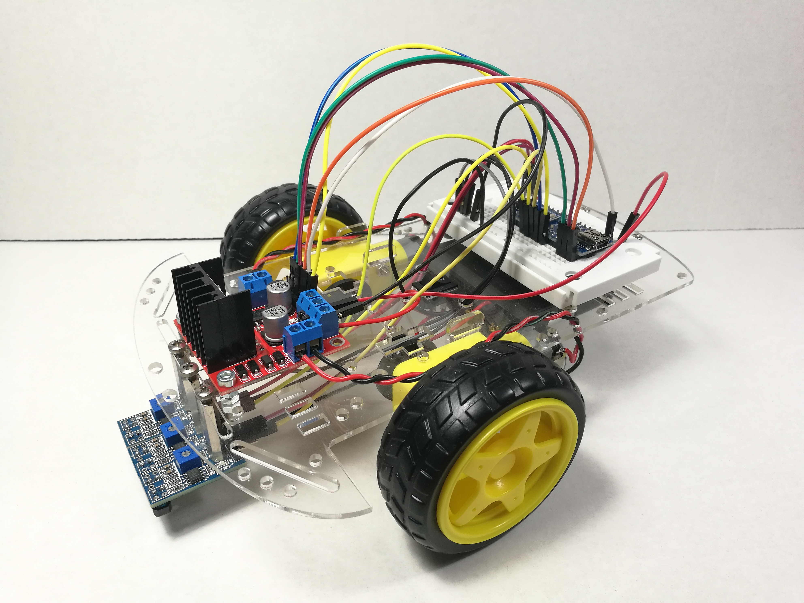
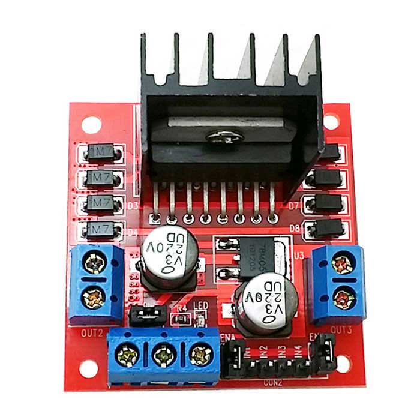
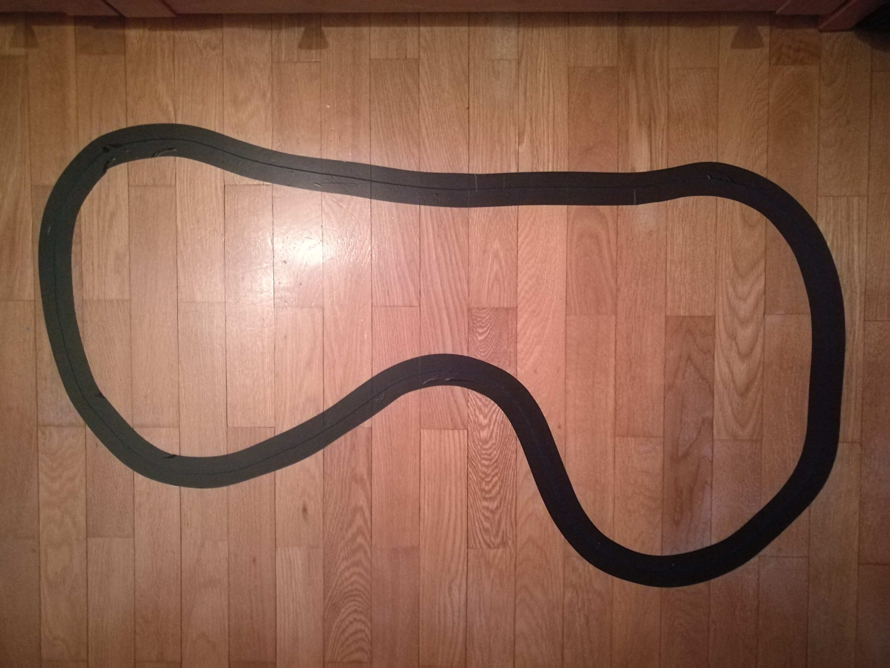

# ROBOT SIGUELINEAS

## Lista de componentes
A continuación se enumerarán los componentes para montar la versión básica. Los elementos añadidos para las siguientes versiones se enumerarán en cada una de estas.

* Chasis policarbonato
* Arduino Nano
* Protoboard 400 puntos o similar
* 2 x motores DC con ruedas
* Portapilas (4xAA)
* Interruptor
* Rueda loca
* Módulo L298N
* 3 x módulo infrarrojo TCRT5000
* Separadores varios
* Cables dupont

---
### Información de los motores
* Tensión de alimentación: 3-12V (Recomendada: 6-8V)
* Reductora con relación 1:48.
* Par máximo: 800 g·cm (3V)
* Velocidad sin carga: 170 rpm (3V)
* Corriente de carga: 70 mA (3V) - 250 mA máx.

>Se alimentarán con el portapilas mencionado anteriormente, es decir, 6V.

---
### Información del módulo L298N

Permite controlar motores de entre 5 a 35V con una salida que puede suministrar hasta 2A.

Posee un jumper para controlar el regulador de tensión 7805 que incorpora.

**JUMPER PUESTO - Regulador activado**: Para motores de 5 a 12V. El conector +5V funciona como salida, suministrando hasta 500 mA.

**SIN JUMPER - Regulador desactivado**: Para motores que trabajen con alimentaciones de 12 a 35V. El terminal +5V deberá conectarse a una señal de 5V para alimentar la parte lógica del driver.

***¡ATENCIÓN! No alimentar el terminal +5V con el jumper puesto para evitar dañar el módulo.***

***
# Montaje

La alimentación del portapilas irá directamente al driver conectado el cable rojo al terminal +12V del driver, pasando previamente por el interruptor, y el cable negro al terminal GND.

Asegurarse de que el jumper está puesto, ya que la salida de 5V se utilizará para alimentar el Arduino.

**Conexión del driver con los motores:**

| DRIVER              | MOTOR IZQUIERDO        | MOTOR DERECHO          |
|--------|--------|--------|
| 
OUT1
 | 
ROJO
  | 
-
     |
| 
OUT2
 | 
NEGRO
 | 
-
     |
| 
OUT3
 | 
-
     | 
ROJO
  |
| 
OUT4
 | 
-
     | 
NEGRO
 |

**Conexión del driver con el Arduino:**

> *NOTA: Retirar los jumpers de los terminales ENA y ENB*

| DRIVER               | ARDUINO              |
|--------|--------|
| 
GND
 | 
GND
 |
| 
+5V
 | 
5V
  |
| 
ENA
 | 
D6
  |
| 
IN1
 | 
D13
 |
| 
IN2
 | 
D12
 |
| 
IN3
 | 
D11
 |
| 
IN4
 | 
D10
 |
| 
ENB
 | 
D5
  |

**Conexión de los sensores infrarrojos con el Arduino:**

Se emplearán los terminales D0 de los sensores y los terminales VCC y GND de cada uno de ellos se conectarán a 5V y GND, respectivamente.

| MÓDULO INFRARROJO                 | ARDUINO             |
|--------|--------|
| 
Sensor izquierda
 | 
D4
 |
| 
Sensor central
   | 
D3
 |
| 
Sensor derecha
   | 
D2
 |

***
# Calibrar sensores infrarrojos

A través del sketch `01_CODIGOS_ARDUINO/prueba_infrarrojos.ino` se permite seleccionar uno de los tres sensores TCRT5000 conectados al Arduino para ajustar el potenciómetro que incorporan para una detección correcta de la línea de color negro. Al detectar la línea se enciende el LED del pin 13 de Arduino Nano.

Otro modo de calibraación sería alimentarlos y observar los LEDs que incluye el módulo; uno para indicar la alimentación y otro de detección. Cuando este úlitmo LED se apaga indica la detección del color negro.

Sabiendo esto se ajustará la sensibilidad de cada uno de los sensores.

***
# Comprobar sentido de giro de los motores

El control del sentido de cada uno de los motores se realizará mediante los pines IN1 e IN2 para el motor A (derecho) y los pines IN3 e IN4 para el motor B (izquierdo).

Las distintas configuraciones de los valores lógicos de estos pines se recogen en la siguiente tabla:

| IN1 / IN3 | IN2 / IN4 | FUNCIÓN |
|--------|--------|--------|
| 
HIGH
 | 
LOW
 | 
Giro sentido A
 |
| 
LOW
  | 
HIGH
 | 
Giro sentido B
 |
| 
LOW
 | 
LOW
 | 
Motor parado
 |

La velocidad de cada uno de los motores se controlará mediante los pines ENA, para controlar el motor A, y ENB, para el motor B. Bastará con enviar una señal PWM a cada uno de estos pines para variar la velocidad de cada motor.

Sabiendo todo esto se hace uso del sketch `01_CODIGOS_ARDUINO/prueba_sentido_motores.ino` para comprobar el sentido de giro de cada motor a partir de los valores de los pines que se acaban de mencionar.

El sketch contiene cinco funciones para comprobar las distintas funciones de movimiento del robot: `Adelante()`, `Atras()`, `Derecha()`, `Izquierda()` y `Parar()`. Cada una de ellas se seleccionará mediante el envío de una letra a través del terminal.

| LETRA | FUNCIÓN |
|--------|--------|
| 
F
 | 
`Adelante()`
 |
| 
B
 | 
`Atras()`
 |
| 
R
 | 
`Derecha()`
 |
| 
L
 | 
`Izquierda()`
 |
| 
S
 | 
`Parar()`
 |

Si alguna función resulta errónea bastará con modificar los valores que se envían a los pines IN1 e IN2, para el motor A, o IN3 e IN4, para el motor B.

***
# Circuito de pruebas

El circuito que se muestra en la imagen será en el que se realicen las pruebas para comprobar y ajustar el funcionamiento del robot.

La línea negra tiene un grosor de unos 35mm.

***
# Robot\_siguelineas\_v1

El principio de funcionamiento de esta primera versión es:

* Si el sensor central detecta la línea negra el robot se desplazará hacia adelante.
* Si el sensor derecho detecta la línea negra el robot girará hacia la derecha.
* Si el sensor izquierdo detecta la línea negra el robot girará hacia la izquierda.

El sketch de esta versión se encuentra en `01_CODIGOS_ARDUINO/Robot_siguelineas_v1`

En la siguiente versión se implementará un PID.